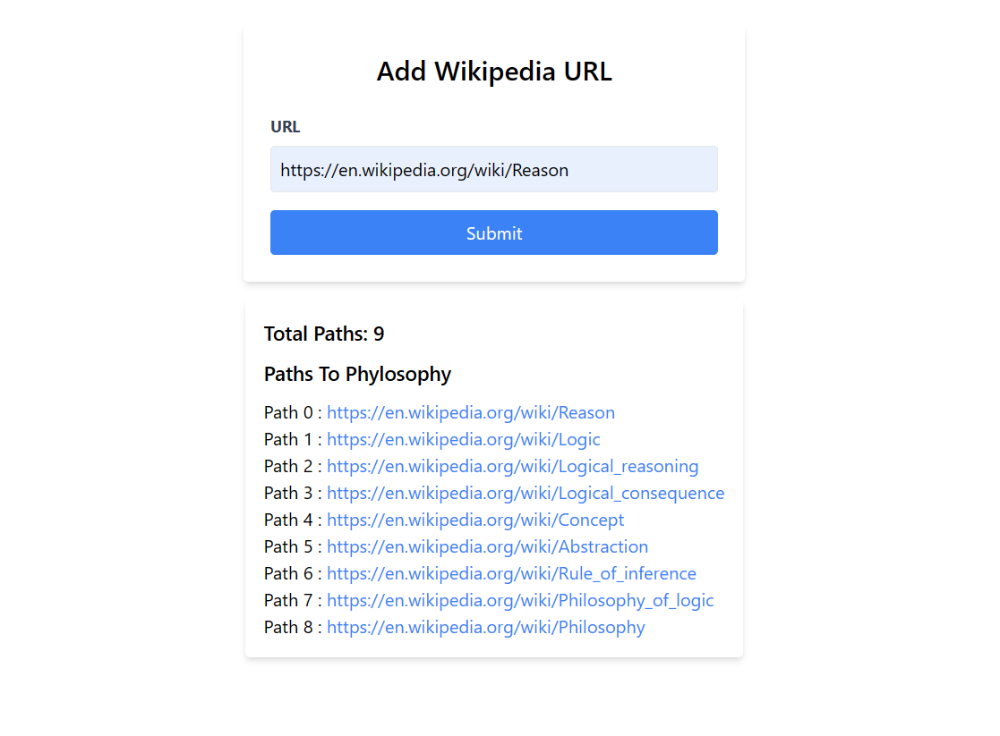

 

  

  <h3 align="center">Wikipedia Loop Checker</h3>

## Table Of Contents

- [About the Project](#about-the-project)
- [Built With](#built-with)
- [Getting Started](#getting-started)
  - [Prerequisites](#prerequisites)
  - [Installation](#installation)
- [Usage](#usage)
- [Authors](#authors)
- [Acknowledgements](#acknowledgements)

## About The Project

The Wikipedia Philosophy Loop Detector is a web application/API designed to explore the well-known phenomenon known as the "Wikipedia Loop." The phenomenon involves navigating through Wikipedia articles by clicking the first link in the main body text and eventually reaching the "Philosophy" page. This project aims to determine the number of requests it takes to reach the "Philosophy" page from a given Wikipedia URL while also displaying the path of visited pages along the way.

## Built With

Node.js
Express (Web framework)
React Js

## Getting Started

1)git clone https://github.com/UdayGohel/Task.git
2)cd wikipedia
npm install
3)npm start 4) cd client 5) npm start

### Prerequisites

Open your web browser and go to http://localhost:3000 to use the Wikipedia Philosophy Loop Detector in React JS.

### Installation

1)Clone the Repository:
->git clone https://github.com/UdayGohel/Task.git

2)Navigate to Project Directory:
-> cd Task

3)Install Dependencies:
-> npm install

4)Run the Application for Back-end:
-> npm start

5)Navigate to React Project Directory:
-> cd client

5)Install Dependencies for React JS :
-> npm install

6)Run the Application for Front-end :
-> npm start

## Usage

1.Open your web browser and go to http://localhost:3000.
2.Enter a valid Wikipedia URL in the provided input field.
3.Click the "Sumbit" button to initiate the process.
4.Observe the real-time display of visited pages and the number of requests.
5.The traversal continues until the "Philosophy" page is reached, and the results are displayed.

## Authors

- _UdayGohel_ - I am currently a Third-year student pursuing a Bachelor's in Information Technology at Vishwakarma Government Engineering College. - [UdayGohel]() - \\
